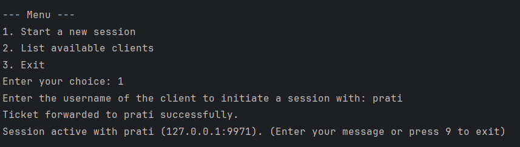

# Step 1: Run the Server
1. Start the server to listen for client connections and manage session keys.

`python server.py`

# Step 2: Register Clients
Start each client, register them with the server, and initiate communication.

<b>Client A:</b>

`python client.py`

####  After starting the client:

1. Enter the username for Client A when prompted.
2. Enter private key file when prompted, or just press Enter to generate new ones.

The client will automatically register with the server.

Note: If running on same machine run clients from different folders. Or the key files will be overwritten.

# Step 3: Initiate a Session
To initiate a secure session between the two clients:

1. Use menu option 2 to list available clients.
2. Use menu option 1 to start a new session.
   1. Enter target machine user name when prompted.
   

# Step 4: Exchange Messages
After the session is established, the clients can send and receive encrypted messages.

* Once session is established the menu is no longer available.
* Enter the message you want to send to the other user.
* Press 9 to exit the session

Initiator:

Responder:

_Note: On receiver client side, Press 0 to entre the chat session._

# Step 5: Terminate the Session
The session clossed when either user presses 9, and server updates their status back to idle.

# Existing user login
An exisiting user can join the network as follows:
1. Select 2 in main Menu option
2. Enter username when prompted
3. Enter the same private key file name that was used to login. If you have the change the key file, press enter the script the will look for deafult `private_key.pem` file in the current folder.

